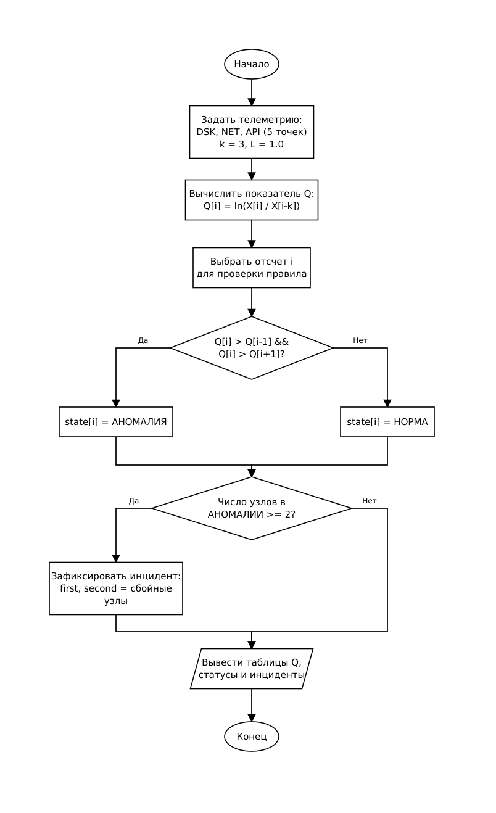

# Курсовой проект: Программа контроля облачной инфраструктуры

## Контрольная точка 1:

### Вариант 9:

- **Компоненты:** `DSK`, `NET`, `API`
- **Порядок записи во входных данных:** формат `В` (`компонент время значение`, разделитель — запятая).
- **Тип последовательности (6):** у одного компонента могут быть разные значения на одном отсчёте; все измерения учитываются.
- **Телеметрия за пять отсчётов - одна строка:**

  DSK,2,48.3,API,5,30.9,NET,1,55.6,DSK,5,52.9,NET,4,55.0,NET,3,57.0,DSK,3,46.5,DSK,4,47.0,API,1,33.9,NET,5,53.0,API,3,32.4,API,4,31.6,NET,2,53.6,DSK,4,49.3,DSK,2,46.0,API,2,33.1,DSK,1,45.5

- **Производный показатель $Q$:** 
  $$Q[i] = \ln\left(\frac{X[i]}{X[i-k]}\right)$$
  
  **Параметры:**
 `k = 3, L = 1.0, D = 10.`
- **Правило состояния компонента:**  
  Если текущее $Q$ больше предыдущего и следующего `(Q[i] > Q[i-1] и Q[i] > Q[i+1])`, состояние **«АНОМАЛИЯ»**, иначе **«НОРМА»**.
- **Правило инцидента (Большинство):**  
  Инцидент возникает, если большинство присутствующих компонентов ($\ge 2$ из 3) находятся в проблемном состоянии:
  
  `Incident(t) = (S_DSK[t] ∧ S_NET[t]) ∨ (S_DSK[t] ∧ S_API[t]) ∨ (S_NET[t] ∧ S_API[t])`
- **Структура Incident:**
  ```
  typedef struct {
      int time;
      int type;
      int first;
      int second;
  } Incident;
  ```
  Поля: номер отсчёта (`time`), тип (`type`), индексы двух проблемных компонентов (`first`, `second`).
  
  Проверь: вручную рассчитай Q для доступных пар, определи состояния компонентов и запиши булево выражение инцидента.

---
## Таблица компонентов по времени
| t | Компонент | Значение |
|---|-----------|----------|
| 1 | NET | 55.6 |
| 1 | API | 33.9 |
| 1 | DSK | 45.5 |
| 2 | DSK | 48.3 |
| 2 | NET | 53.6 |
| 2 | DSK | 46.0 |
| 2 | API | 33.1 |
| 3 | NET | 57.0 |
| 3 | DSK | 46.5 |
| 3 | API | 32.4 |
| 4 | NET | 55.0 |
| 4 | DSK | 47.0 |
| 4 | API | 31.6 |
| 4 | DSK | 49.3 |
| 5 | API | 30.9 |
| 5 | DSK | 52.9 |
| 5 | NET | 53.0 |
## 1. Алгоритм 


1. Задать массивы телеметрии из карточки варианта для трёх компонентов (`DSK`, `NET`, `API`) на 5 отсчётов времени ($t = 1 \dots 5$). Для компонента `DSK`, имеющего на отсчётах 2 и 4 повторные измерения (тип 6), учесть все поступившие значения путём усреднения на соответствующем отсчёте.
2. Задать параметры: шаг сравнения $k = 3$, порог $L = 1.0$.
3. Для каждого компонента вычислить показатель $Q[i] = \ln(X[i] / X[i-k])$ для доступных пар (отсчёты $i = 4, 5$).
4. Определить состояние компонентов по правилу «Локальная аномалия»:
   - для отсчётов $t = 1, 2, 3$ пар со сдвигом $k = 3$ нет $\rightarrow$ статус «НОРМА»;
   - для отсчётов $t = 4, 5$ проверить условие $Q[i] > Q[i-1]$ и $Q[i] > Q[i+1]$: при отсутствии одного из соседей (граничные элементы) условие локального максимума не выполняется $\rightarrow$ статус «НОРМА».
5. Проверить возникновение инцидента по правилу «Большинство»: если не менее 2 компонентов находятся в состоянии «АНОМАЛИЯ», зафиксировать инцидент, сохранив номер отсчёта, тип и индексы двух сбойных узлов (`first` и `second`).
6. Вывести исходные данные, рассчитанные показатели $Q$, состояния компонентов и журнал инцидентов.

### 2. Блок-схема алгоритма 



---

## 3. Контрольный пример: ручной расчёт


---

## 4. Реализация программы

Код программы: [Source.c](Source.c)

---

## 5. Результаты работы программы


---
## 6. Сравнение программы с ручным расчётом

Вывод программы полностью совпадает с ручным контрольным расчётом.

## 7. Вывод

В ходе выполнения контрольной точки 1 реализован базовый расчёт логарифма отношения динамики компонентов, проверено правило локальной аномалии и сформирована логика выявления инцидентов по правилу большинства для тестового набора отсчётов.

---

## 8. Информация о разработчике

- **Студент:** Губский Данил Максимович
- **Группа:** бОТИ-261


